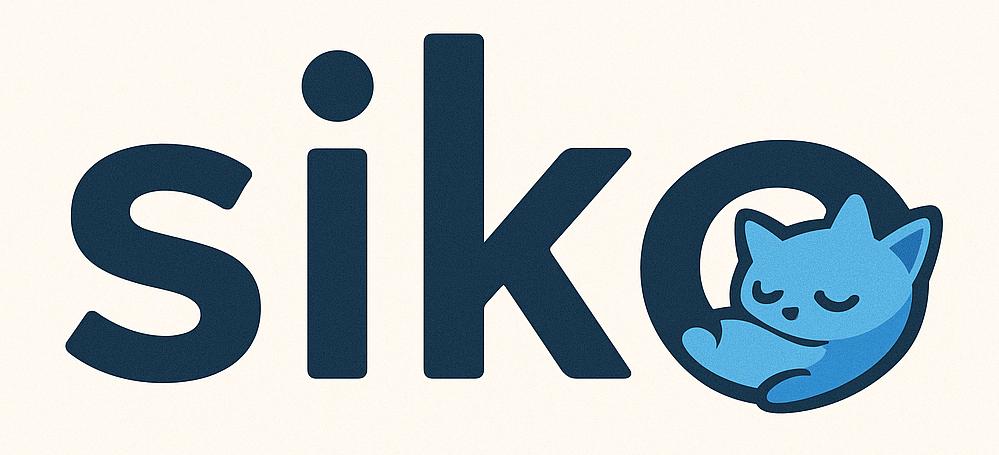

# Siko programming language

Status: 

## Testing

Run the full test suite:

```sh
make test
```

`make test` builds `siko.bin` and `runner.bin`, runs the standard library's own
`std/Common` tests, then runs the snapshot suite. The runner reports the normal
snapshot suite first, then runs the success/failure cases again with `--llvm`.
LLVM-mode failures are reported separately and do not affect the runner's exit
status.

For targeted snapshot runs, build the runner and pass substring filters:

```sh
make runner.bin
./runner.bin echo5
./runner.bin --c ./siko2.bin typecheck # runs everything containing typecheck using siko2.bin as compiler
```

The runner discovers cases under `test/success/nostd`, `test/success/std`, and
`test/failure`. A directory containing `main.sk` is a case; if it also has
`package.toml`, the directory is built as a package, otherwise `main.sk` is
built directly. Success cases compile and run the binary from the case
directory, then compare stdout with `output.txt`. Failure cases expect the
compiler to fail and compare compiler stdout with `output.txt`. Add a `SKIP`
file in a case directory to skip it.

Useful flags:

- `--bless`: rewrite `output.txt` snapshots from current output.
- `--valgrind`: run success-case binaries under Valgrind.
- `--c <compiler>`: use a compiler other than `./siko.bin`.

## LLVM backend

`build` defaults to the C executable backend. Use `--llvm` to compile through
the LLVM backend path instead. The compiler writes textual LLVM IR first, then
asks LLVM tooling to compile that IR into the executable:

```sh
./siko.bin build test/success/std/hello_world/main.sk --llvm -o hello
less hello.ll
./siko.bin build test/success/std/hello_world/main.sk --llvm --llvm-ir /tmp/hello.ll -o hello
./siko.bin build test/success/std/hello_world/main.sk --llvm-ir /tmp/hello.ll
```

The direct LLVM lowering work should follow the `misc/basicblock_final.md`
plan: lower to explicit basic blocks before replacing the C-shaped bridge.

## License

MIT

## Community

[Discord](https://discord.com/invite/Gfd8YDrYVC)

## Website

https://www.siko-lang.org
