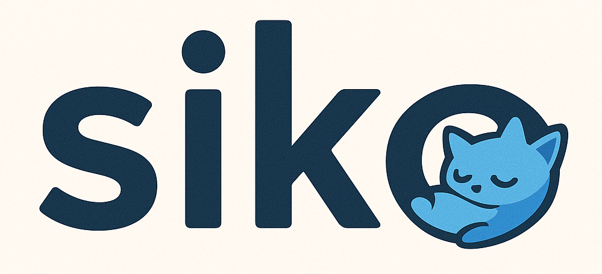

# Siko programming language

Status: 

Run tests
```
make test
```

## License

MIT

## Community

[Discord](https://discord.com/invite/Gfd8YDrYVC)

## Design Philosophy and Goals

Siko is shaped by years of experience with C++/Go and Rust and a desire to address common frustrations found in modern programming languages. The following principles and ideas guide its ongoing development:

- **Memory Safety**: Siko aims for memory safety on par with Rust. While the borrow checker isn't present yet, achieving robust safety guarantees is a core objective.

- **Performance**: The language is designed to deliver performance comparable to Rust, avoiding unnecessary runtime or syntactic overhead. However, Siko is not intended to be a Rust clone; it seeks a balance between safety, performance, and ergonomic design, sometimes favoring more flexible solutions where appropriate.

- **Metaprogramming and Compile-Time Execution**: Siko wants to explore compile-time code execution as the primary mechanism for metaprogramming. The goal is to provide a low-overhead, expressive way to generate code, improving upon the limitations and complexity of Rust's procedural macros.

- **Implicits and Effect Systems**: Siko incorporates implicits and effect systems, aiming to allow users to safely compose and use third-party libraries. The vision is to guarantee, at compile time, that external code cannot perform unintended effects beyond those explicitly permitted by the user.

- **Generators and Coroutines**: The language aspires to offer simple, efficient generators and coroutines, enabling constructs like yielding from a for loop and using the result as an iterator, all with minimal overhead.

- **Concurrency and Actor Model**: Inspired by goroutines and actor-style programming, Siko intends to support lightweight concurrency primitives.

- **Type System and Language Features**: Siko is experimenting with various type system features, including implicit auto-cloning for types where desired, and a strict policy of no global variables. The language does not enforce the orphan rule for instances.

- **Error Handling**: Error handling in Siko is still evolving. Currently, it uses Rust-style enums, but the goal is to allow flexible error recovery, including the ability to panic and recover at any call site if needed, maybe some form of exceptions as well.

- **Immutability by Default**: Most constructs in Siko are immutable by default, with mutability allowed for local variables and in explicitly marked unsafe contexts.

